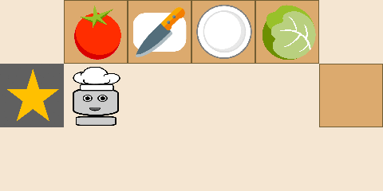
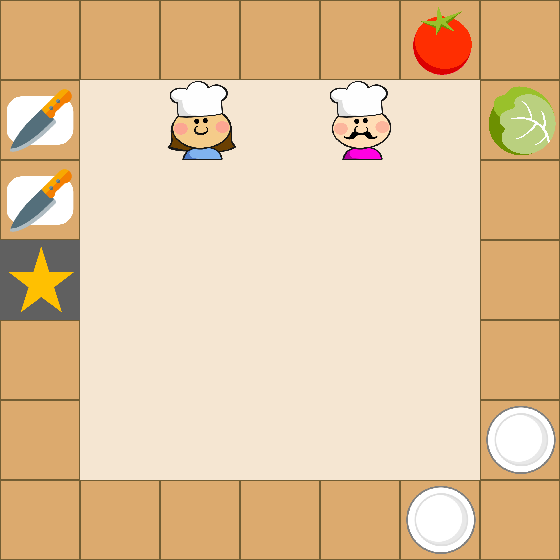
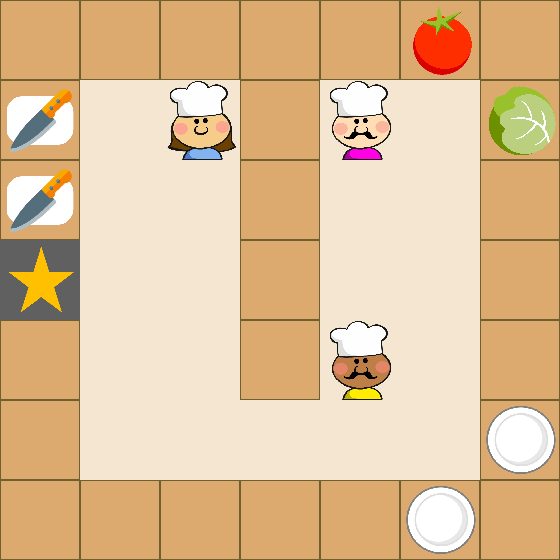
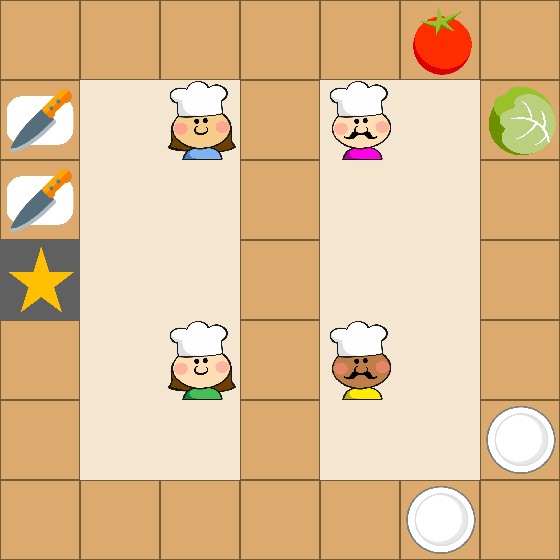

# Code for OvercookedEnvironment (gym-cooking) and "Too many cooks: Bayesian inference for coordinating multi-agent collaboration"

A modified version of the code from ["Too many cooks: Bayesian inference for coordinating multi-agent collaboration"](https://arxiv.org/pdf/2003.11778.pdf), to let a single agent train using Simple Q-learning, for a simplified environment.

For the original code for ["Too many cooks: Bayesian inference for coordinating multi-agent collaboration"](https://arxiv.org/pdf/2003.11778.pdf), Winner of CogSci 2020 conference award in computational modelling, see the [original repository](https://github.com/rosewang2008/gym-cooking)

Most significant changes w.r.t. original code:
- Uses updated pygame to version 2.0.1
- Includes 'walls', places where the agent cannot place objects to lower complexity.
- Salad recipe has to be served as: lettuce + tomato on a plate. We do not serve 'tomato' or 'lettuce' separately.
- Implemented Simple Q-learning
- Removed action (0, 1) (move down) - as we used grids in which we never want to 'move down'. To simplify. However, this can be re-added easily.
- Added a 'robot agent' graphic called `agent-white.png`

<p align="center">
    </img>
</p>

Please use this bibtex if you want to cite this repository in your publications:
```
@article{wang2020too,
  title={Too many cooks: Coordinating multi-agent collaboration through inverse planning},
  author={Wang, Rose E and Wu, Sarah A and Evans, James A and Tenenbaum, Joshua B and Parkes, David C and Kleiman-Weiner, Max},
  journal={arXiv preprint arXiv:2003.11778},
  year={2020}
}
```
Contents:
- [Installation](#installation)
- [Usage](#usage)
- [Environments and Recipes](docs/environments.md)
- [Design and Customization](docs/design.md)

## Installation

You can install the dependencies with `pip3`:
```
git clone -b simple_qlearning https://github.com/Sannevw/gym-cooking.git
cd gym-cooking
pip3 install -e .
```

All experiments have been run with `python3`! 

## Usage 

Here, we discuss how to run a single experiment, run our code in manual mode, and re-produce results in our paper. For information on customizing environments, observation/action spaces, and other details, please refer to our section on [Design and Customization](docs/design.md)

For the code below, make sure that you are in **gym-cooking/gym_cooking/**. This means, you should be able to see the file `main.py` in your current directory.

<p align="center">
    </img>
    </img>
    </img>
</p>

### Training an agent

The basic structure of our commands is the following:

`python main.py --num-agents 1 --level <level name>`

where `<number>` is always 1 but argument kept for potential upscaling, `level name` are the names of levels available under the directory `cooking/utils/levels`, omitting the `.txt`.

For example, running the salad recipe on a 3x6 grid looks like:
`python main.py --num-agents=1 --level salad_3x6grid`

Although our work uses object-oriented representations for observations/states, the `OvercookedEnvironment.step` function returns *image observations* in the `info` object. They can be retrieved with `info['image_obs']`.  

### Testing your trained agents

`python run_trained.py --num-agents 1 --level <level> --record --fname <fname>`
where `<level>` is the level you trained your agent in e.g., `salad_3x6grid` and `<fname>` is the pickle file name where the trained agent is saved to, e.g., `salad_3x6grid_agents1_seed1.pkl`

You will find a successful run (if the agent is trained properly to succeed at the recipe) here:
`/misc/game/record/trained_agent/<img_save_name>`
where `<img_save_name>` is the level name + how many agents + the seed: e.g., `simple_tomato_4x6grid_agents1_seed1`

### Additional commands

The above commands can also be appended with the following flags:
* `--record` will save the observation at each time step as an image in `misc/game/record`.

### Manual control

To manually control agents and explore the environment, append the `--play` flag to the above commands. Specifying the model names isn't necessary but the level and the number of agents is still required (!TODO: This could be removed for our single agent purposes). For instance, to manually control an agent with the salad task on the open divider, run:

`python main.py --num-agents 1 --level open-divider_salad --play`

This will open up the environment in Pygame. Hit the Enter key to save a timestamped image of the current screen to `misc/game/screenshots`.

